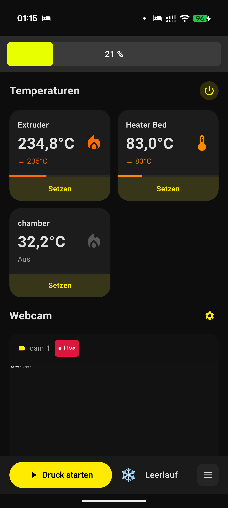
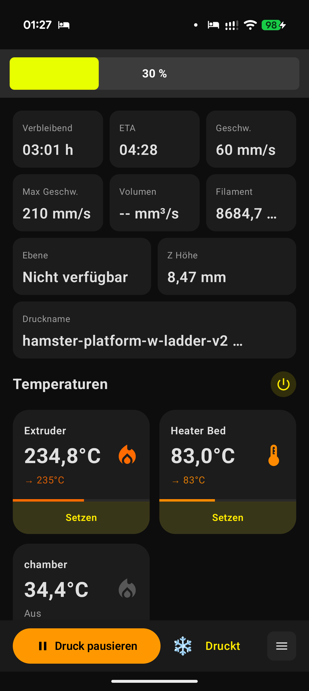
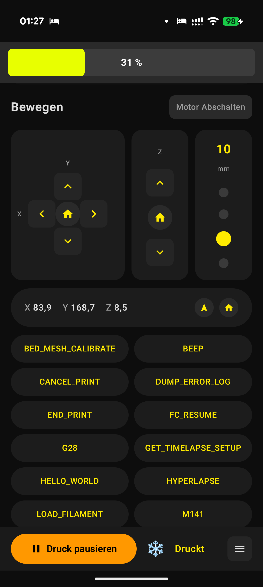
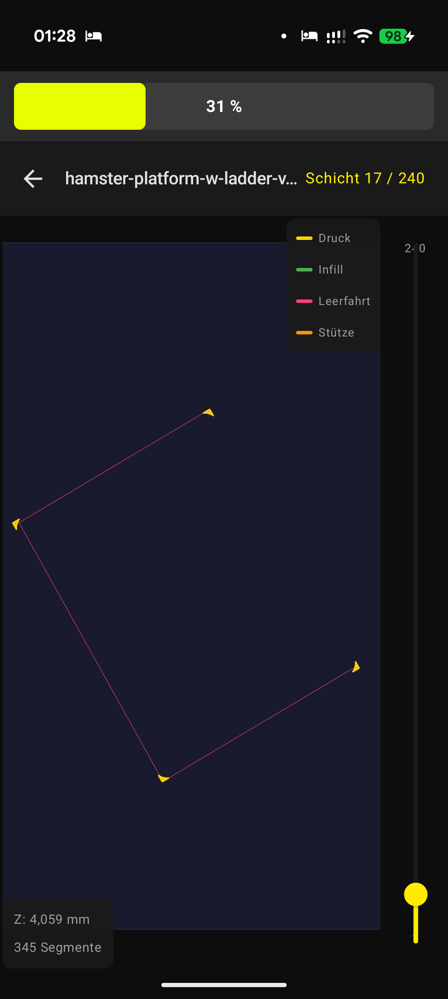
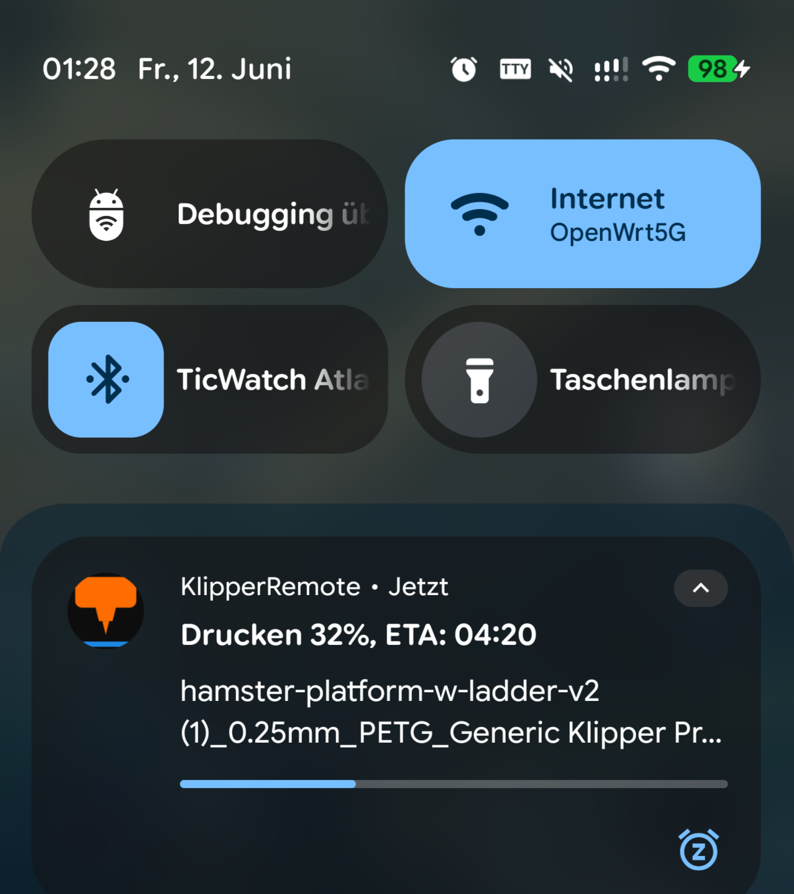
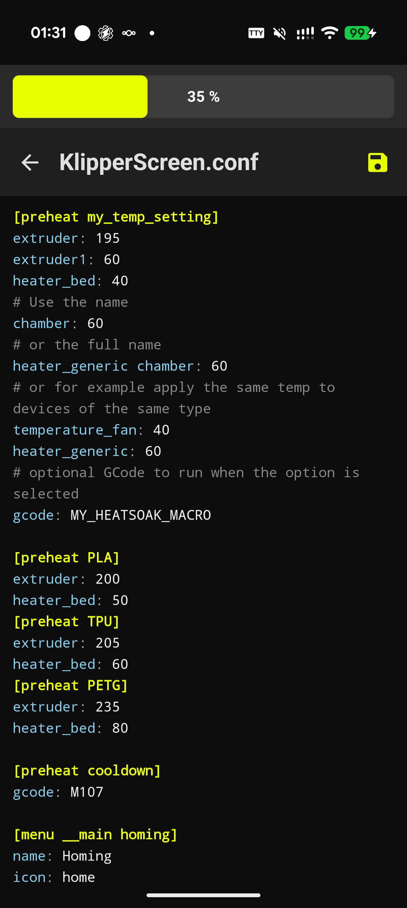

# KlipperRemote

Eine Android-App (Jetpack Compose) zur Fernsteuerung von 3D-Druckern über
[Moonraker](https://moonraker.readthedocs.io/) / Klipper – Temperaturen setzen,
Webcam-Stream ansehen und Druckstatus überwachen.

## Was die App alles kann

- **Temperatur-Steuerung** – Übersicht für Extruder, Heizbett und Kammer; Soll-Temperaturen direkt setzen.
- **Webcam-Stream** – Live-Bild des Druckers per MJPEG.
- **Druckerstatus-Polling** – laufende Statusabfrage über Moonraker (Leerlauf / Druckt / Pausiert / Fehler).
- **Detaillierter Druckstatus** – Restzeit, ETA, Druckgeschwindigkeit, Filamentverbrauch, Z-Höhe und Druckname.
- **Druck-Steuerung** – Druck über die Bottombar starten, pausieren oder abbrechen.
- **GCode-Datei-Browser** – auf dem Drucker gespeicherte Dateien durchsuchen und Druck starten.
- **GCode-Viewer** – Vorschau mit Schicht-Slider, Zoom und farbiger Pfad-Legende.
- **Achsensteuerung & Makros** – Achsen bewegen, Homing ausführen und eigene G-Code-Makros anlegen.
- **Konfigurations-Editor** – Klipper-/KlipperScreen-Konfigurationsdateien (z. B. `printer.cfg`,
  `KlipperScreen.conf`) direkt in der App mit Syntax-Hervorhebung bearbeiten und speichern.
- **Push-Benachrichtigung** – laufender Fortschritt und ETA als Notification während des Drucks.
- **Crash-Log-Anzeige** – integrierte Fehlerprotokolle zur Diagnose.
- **Dunkles, modernes UI** mit farbigen Akzenten.

## Screenshots

| Übersicht & Temperaturen | Druckstatus | Bewegen & Makros |
|---|---|---|
|  |  |  |

| GCode-Viewer | Benachrichtigung | Konfigurations-Editor |
|---|---|---|
|  |  |  |

## Einrichtung & Verbindung

Beim ersten Start öffnest du die **Einstellungen** und trägst die Verbindungsdaten
deines Druckers ein:

| Feld | Beschreibung |
|------|--------------|
| **Host / IP-Adresse** | IP oder Hostname des Druckers, auf dem Moonraker läuft (z. B. `192.168.1.50` oder `mainsailos.local`). |
| **Port** | Moonraker-Port – standardmäßig `7125`. |
| **API Key** *(optional)* | Nur nötig, wenn Moonraker Authentifizierung verlangt (siehe unten). |

Die App spricht direkt mit der [Moonraker](https://moonraker.readthedocs.io/)-API
deines Druckers – es ist kein Cloud-Konto und kein externer Server nötig.

### API Key abrufen

In den meisten Mainsail-/Fluidd-Setups ist für Geräte im selben lokalen Netzwerk
**kein** API Key erforderlich – dann lässt du das Feld einfach leer. Ein Key wird
nur gebraucht, wenn Moonraker so konfiguriert ist, dass er Authentifizierung
verlangt (z. B. Zugriff von außerhalb des Heimnetzes oder restriktive
`[authorization]`-Einstellungen).

Falls du einen API Key benötigst:

1. **Moonraker für Authentifizierung konfigurieren** – in `moonraker.conf` im Abschnitt
   `[authorization]` ist dein lokales Netz unter `trusted_clients` hinterlegt.
   Clients außerhalb dieses Bereichs müssen sich per API Key authentifizieren.
2. **Key auslesen** – Moonraker legt den API Key in der Datei `.moonraker_api_key`
   im Home-Verzeichnis ab (z. B. `~/printer_data/.moonraker_api_key` bzw.
   `~/.moonraker_api_key`). Per SSH:
   ```bash
   cat ~/printer_data/.moonraker_api_key
   ```
3. **Über die Weboberfläche** – in **Mainsail** bzw. **Fluidd** findest du den Key
   unter *Einstellungen → Allgemein → API Key* und kannst ihn dort kopieren oder neu
   generieren.
4. Den kopierten Key trägst du in der App unter **Einstellungen → API Key** ein.
   Er wird bei jeder Anfrage als `X-Api-Key`-Header an Moonraker gesendet.

## Build

```bash
./gradlew assembleDebug      # Debug-APK
./gradlew assembleRelease    # Signierte Release-APK (siehe Signierung)
```

Min SDK 26, Target/Compile SDK 34, JVM 17.

## Signierung

Release-Builds werden signiert. Die Signaturdaten kommen entweder aus einer
lokalen `keystore.properties` oder aus Umgebungsvariablen (CI):

| Property (`keystore.properties`) | Env-Variable (CI)    |
|----------------------------------|----------------------|
| `storeFile`                      | `KEYSTORE_FILE`      |
| `storePassword`                  | `KEYSTORE_PASSWORD`  |
| `keyPassword`                    | `KEY_PASSWORD`       |
| `keyAlias`                       | `KEY_ALIAS`          |

Lokal: `keystore.properties.example` nach `keystore.properties` kopieren und
ausfüllen. Weder der Keystore noch die Passwörter werden eingecheckt
(`.gitignore`).

## CI / Release

`.github/workflows/build.yml` baut bei jedem Push auf `main` eine signierte
Release-APK und veröffentlicht sie unter **Releases**. Dafür müssen folgende
GitHub-Actions-Secrets gesetzt sein:

- `KEYSTORE_BASE64` – Base64-kodierter Keystore (`base64 -w0 release.jks`)
- `KEYSTORE_PASSWORD`
- `KEY_PASSWORD`
- `KEY_ALIAS`

## Deploy

```bash
./push-and-deploy.sh ["Commit-Nachricht"]
```

Committet & pusht nach GitHub, verfolgt den Actions-Build und zeigt den
veröffentlichten Release-Link. Authentifizierung über die GitHub CLI
(`gh auth login`) – es werden keine Secrets im Skript gespeichert.

## Lizenz

MIT
